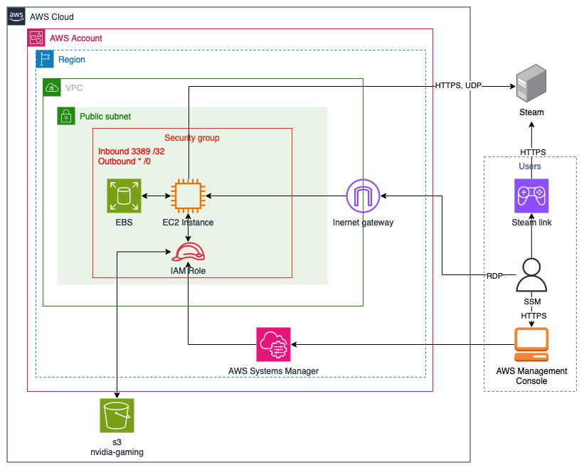

# **Game On-Demand: Unlocking Cost-Efficient Cloud Gaming with Amazon EC2's Pay-as-You-Go Model using Steam**

## Introduction

In today's gaming landscape, the concept of cloud gaming is gaining momentum, offering a compelling alternative to traditional gaming setups. With the rise of cloud computing, cloud services providers like [Amazon Web Services](https://aws.amazon.com/) present an opportunity to explore cost-efficient gaming solutions with pay-as-you-go pricing. In this blog post, we'll demonstrate how [Amazon Elastic Compute Cloud (Amazon EC2)](https://aws.amazon.com/ec2) instances can transform your gaming experience without the need for substantial investments in personal gaming hardware.

Our [AWS CloudFormation](https://aws.amazon.com/cloudformation/) template automates the installation and configuration of Steam, providing a seamless gaming experience accessible from any device. Whether you're a seasoned gamer or new to cloud gaming, our user-friendly guide simplifies the deployment of your own cloud gaming setup and allows you to start playing your favorite games in no time.

## Overview of the solution

The main services in this solution are [Amazon Elastic Compute Cloud (Amazon EC2)](https://aws.amazon.com/ec2/) and [Amazon Elastic Block Store (Amazon EBS)](https://aws.amazon.com/ebs/). 
The architecture is as follows:



Figure 1. Diagram describes ways to connect, configure and use AWS resources to play games with Steam

The key components of this solution are described in the following list.

1. **An** [**Amazon EC2**](https://aws.amazon.com/ec2/?ec2-whats-new.sort-by=item.additionalFields.postDateTime&ec2-whats-new.sort-order=desc) **instance of the** [**G5 instance family**](https://aws.amazon.com/ec2/instance-types/g5/). Amazon EC2 G5 instances are the latest generation of NVIDIA GPU-based instances that can be used for a wide range of graphics-intensive and machine learning use cases. They deliver up to 3x better performance for graphics-intensive applications and machine learning inference and up to 3.3x higher performance for machine learning training compared to Amazon EC2 G4dn instances.
2. **An** [**Amazon Elastic Block Store (EBS)**](https://aws.amazon.com/ebs/) **volume**, providing scalable and high-performance block storage for your EC2 instance. Your operating system, applications, and games are stored in this volume.
3. **An** [**Amazon EC2 security group**](https://docs.aws.amazon.com/vpc/latest/userguide/vpc-security-groups.html) **that controls the traffic to your instance.** This configuration allows seamless connectivity to your EC2 instance via Remote Desktop Protocol (RDP) on port 3389.

## Deploying the solution
**Note:** You are responsible for the cost of the AWS services used while running this solution. For full details, refer to the pricing webpage for each AWS service you will use in this solution. You are responsible for ensuring necessary backups are taken of your server in case of data loss. Be prepared to start additional servers in another Availability Zone to handle traffic if one zone goes down. Make sure to regularly apply Windows updates and other security measures to protect your server.

## Deploy the AWS CloudFormation template

1. Save the following [CloudFormation template](https://raw.githubusercontent.com/aws-samples/cloud-gaming-on-ec2-using-steam/main/cloud-gaming-on-ec2-using-steam.yaml) to your local machine.
2. Sign in to the **AWS Management Console** and navigate to **CloudFormation** service.
3. Select **Create Stack.**
4. Select **Choose an existing template** and **Upload a template file**. Select the CloudFormation template that you downloaded from GitHub. Select **Next** to continue.
5. On the **Create stack** page, verify that the correct template URL shows (the one selected in the previous step) in the **Amazon S3 URL** text box and choose **Next**.
6. On the **Specify stack details** page, assign a name to your solution stack.
7. Under **Parameters**, review the parameters for the template and modify them as necessary. This solution uses the following default values.

| **Parameter** | **Default** | **Description**                                                                                                                                                                                                                                                                  |
| --- | --- |----------------------------------------------------------------------------------------------------------------------------------------------------------------------------------------------------------------------------------------------------------------------------------|
| **imageId** | /aws/service/ami-windows-latest/Windows_Server-2019-English-Full-Base | The Amazon Machine Image (AMI) ID specifies the pre-configured image used to launch the EC2 instance. This solution has been tested successfully using the Windows_Server-2019-English-Full-Base image.                                                                          |
| **ec2Name** | Windows Server-GAMING | The name assigned to your EC2 instance for identification and management.                                                                                                                                                                                                        |
| **instanceType** | g5.2xlarge | The instance type defines the virtual hardware specifications of the EC2 instance, such as CPU, memory, and storage capacity. Refer to the provided link for more details on available instance types. ([Amazon EC2 G5 Instances](https://aws.amazon.com/ec2/instance-types/g5)) |
| **vpcID** | \-  | The ID of the Amazon Virtual Private Cloud ([Amazon VPC](https://console.aws.amazon.com/vpcconsole/home#vpcs)) with internet connectivity in which the EC2 instance will deploy.                                                                                                 |
| **subnetID** | \-  | The ID of the subnet with internet connectivity within the specified Amazon VPC where the EC2 instance will reside. ([Amazon Subnets](https://console.aws.amazon.com/vpcconsole/home#subnets:))                                                                                  |
| **displayPublicIP** | Yes | Controls whether the EC2 instance's public IP address is displayed in the CloudFormation outputs. Set to "Yes" if the EC2 instance has a public IP address and you want it to be visible.                                                                                        |
| **assignStaticIP** | No  | Associate static public IPv4 address with the EC2 instance. Refer to the provided link for more information on Elastic IP addresses. ([Elastic IP addresses](https://docs.aws.amazon.com/AWSEC2/latest/UserGuide/elastic-ip-addresses-eip.html))                                 |
| **ingressIPv4** | 0.0.0.0/32 | Allowed source IP address or prefix for RDP connection (IPv4) (for example, 1.2.3.4/32, get your source IP from [select to show your IP](https://checkip.amazonaws.com/))                                                                                                        |
| **volumeSize** | 550 | The size of the EBS volume attached to the EC2 instance, measured in Gibibytes (GiB). This volume stores data, applications, and other files required by the instance.                                                                                                           |
| **volumeType** | Gp3 | The type of EBS volume used for storage. Options include General Purpose SSD (Gp3 and Gp2). Choose the appropriate volume type based on performance and cost requirements.                                                                                                       |

8. Choose **Next**.
9. On the **Configure stack options** page, choose **Next**.
10. On the **Review** page, review and confirm the settings. Check the boxes acknowledging that the template will create [AWS Identity and Access Management](https://aws.amazon.com/iam) (IAM) resources and that it might require the capability AWS::**IAM::Role**.
11. Choose **Submit** to deploy the stack.
12. You can view the status of the stack in the AWS CloudFormation console in the **Status** column. You should receive a **CREATE_COMPLETE** status in approximately 10 minutes. If the status doesn't change, review the "Events" tab for troubleshooting information.
13. Click on the **Outputs** column once stack has been deployed

## Login to the Server and complete the setup

1. Navigate to the SSMsessionManager link found in the **Outputs** section of your deployed CloudFormation stack, and click on it.
2. In the terminal, update the administrator password by entering the following command (ensure to replace `<MyStr@ngAdminPassw0rd>` with your chosen password):
   ```shell
   net user administrator <MyStr@ngAdminPassw0rd>
   ```
3. Navigate to the RDPconnect link found in the **Outputs** section of your deployed CloudFormation stack, and click on it.
4. Enter administrator as the username, and input the password you selected in step 3. Afterward, click the **Connect** button to proceed.
5. Allow some time for the computer to complete its initial login process. Once logged in, proceed to sign in to your Steam account. If you don't have a **Steam** account yet, simply click on the **Don’t have a Steam account? Create A Free Account** link to begin the registration process.
6. Browse through your game library to install a favorite title or explore the Steam Store for new gaming adventures. Once you've made your selection, allow the download and installation process to finish before proceeding.
7. Install the Steam Link app on your preferred device for seamless gaming. Learn more about the app's features and compatibility by selecting [Steam remote play](https://store.steampowered.com/remoteplay).
8. Launch the Steam Link app and seamlessly pair any gaming controller of your choice for an enhanced gaming experience. This step is optional, especially if you're playing on your Smart TV or prefer using a different input method.
9. Now it’s time to pair Steam Link with Steam installed on your Amazon EC2 instance. Click on the cogwheel, then navigate to Computer > Other Computer. Take note of the PIN displayed on the screen and ensure you stay on this pairing screen.
10. Return to your deployed Amazon EC2 instance and launch the Steam application. From there, go to **Steam > Settings > Remote Play**, and choose **Pair Steam Link** to continue the setup. Enter the PIN you noted down in the previous step, then click the **Confirm** to proceed with the pairing process.
11. Verify that the pairing process has been successfully completed on the Steam Link app installed on your Remote Play device.
12. Additionally, you have the option to adjust settings to enhance game streaming performance, though this step is optional. Below, we've outlined the settings that typically yield the best framerate with our configuration. Feel free to experiment and customize them to suit your preferences.
    1. On the Amazon EC2 instance:
        1. go to Steam > Settings > Remote Play > Enable Advanced Host Options
            1. ✅ Change desktop resolution to match streaming client.
            2. ⬜ Dynamically adjust capture resolution to improve client
            3. ⬜ Use NVFBC capture on NVIDIA GPU
            4. ✅ Enable hardware encoding
            5. ✅ Enable hardware encoding on NVIDIA GPU
            6. ⬜ Enable hardware encoding on AMD GPU
            7. ⬜ Enable hardware encoding on Intel GPU
            8. Number of software encoding threads (Automatic)
            9. ✅ Prioritize network traffic
    2. On the Remote Play device:
        1. Cogwheel Icon > Streaming > Customize > Enable Advanced Client Options
            1. ✅ Bandwidth limit = 40 MB/s
            2. ✅ Framerate limit = 60 FPS
            3. ⬜ Hardware Decoding
            4. ✅ HEVC Video
            5. ✅ Low Latency Networking
13. It's time to initiate your first connection to your Amazon EC2 instance from your Remote Play device using the Steam Link app.
_IMPORTANT_**:** Before beginning gameplay, ensure you disconnect your Remote Desktop Protocol (RDP) session. If you're using [AWS Systems Manager Fleet Manager](https://aws.amazon.com/systems-manager/fleet-manager/), simply navigate to Actions > End session. Alternatively, you can utilize the desktop shortcut on the server: `end_rdp_session`. Always follow above step when exiting your RDP session to maintain proper functionality.
Next, launch the Steam Link app and click on the **Start Playing** button to begin your gaming session.
14. Adjusting your screen resolution to fit your display may be necessary. Using a mouse can simplify this process. Simply navigate to Steam Menu > Power > Minimize Steam. Then, access the System Tray in the lower-right corner and click on the **Nvidia icon**. In the **Nvidia Control Panel**, select **Display > Change** resolution, and choose your desired resolution.
If you're using an ultra-wide monitor and your desired resolution, like 3440 x 1440, isn't available, _ensure you're connected via RDP before proceeding_. Open the folder on the desktop and run `SRE.exe`. Add your custom resolution by clicking the **+** button, then click **OK**. Finally, run `restart64.exe` for the custom resolution to become available. Once completed, you can adjust the resolution in the Nvidia Control Panel when logged in via Steam Link.
15. Return to Steam, dive into your favorite game, and enjoy!

## Cleaning up

1. Sign in to the **AWS Management Console** and navigate to **CloudFormation** service.
2. Select the stack created in the “Deploy the AWS CloudFormation template” section.
3. Select **Delete**.

## Conclusion

We demonstrated how AWS can be leveraged as a cost-effective gaming solution, transforming your gaming experience without requiring significant investments in personal gaming hardware.

Visit the Amazon EC2 G5 instances [service page](https://aws.amazon.com/ec2/instance-types/g5/) to learn more about how AWS continues to push the boundaries of cost-effectiveness for graphic-intensive applications.
## Security

See [CONTRIBUTING](CONTRIBUTING.md#security-issue-notifications) for more information.

## License

This library is licensed under the MIT-0 License. See the [LICENSE](LICENSE) file.

